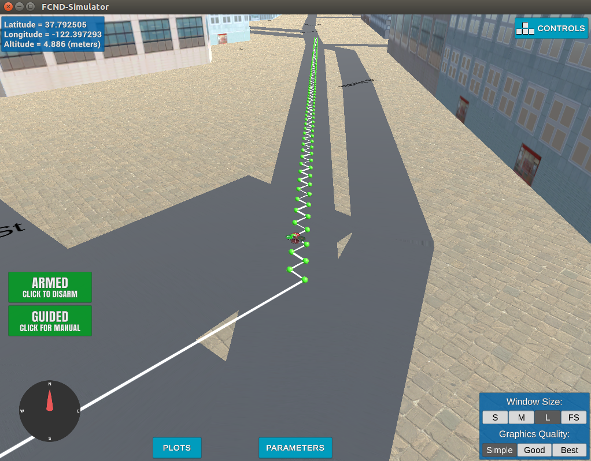
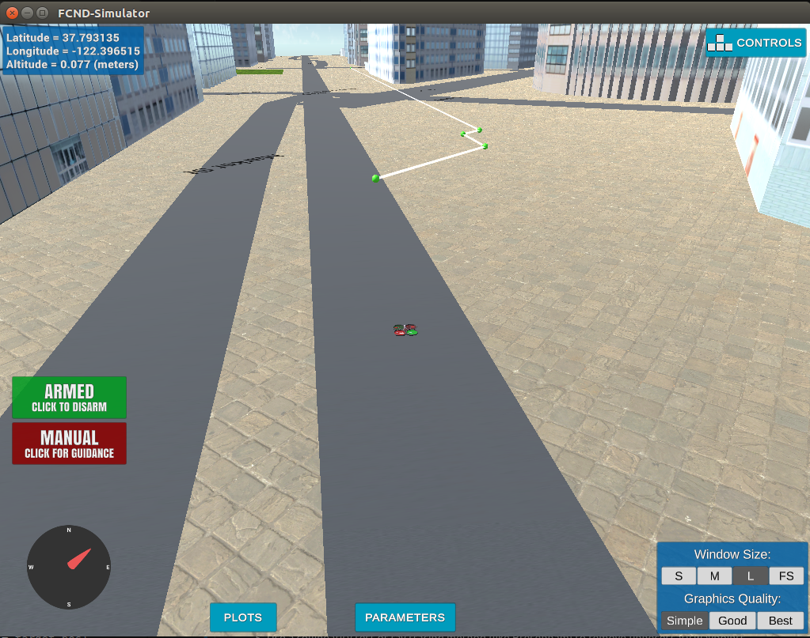
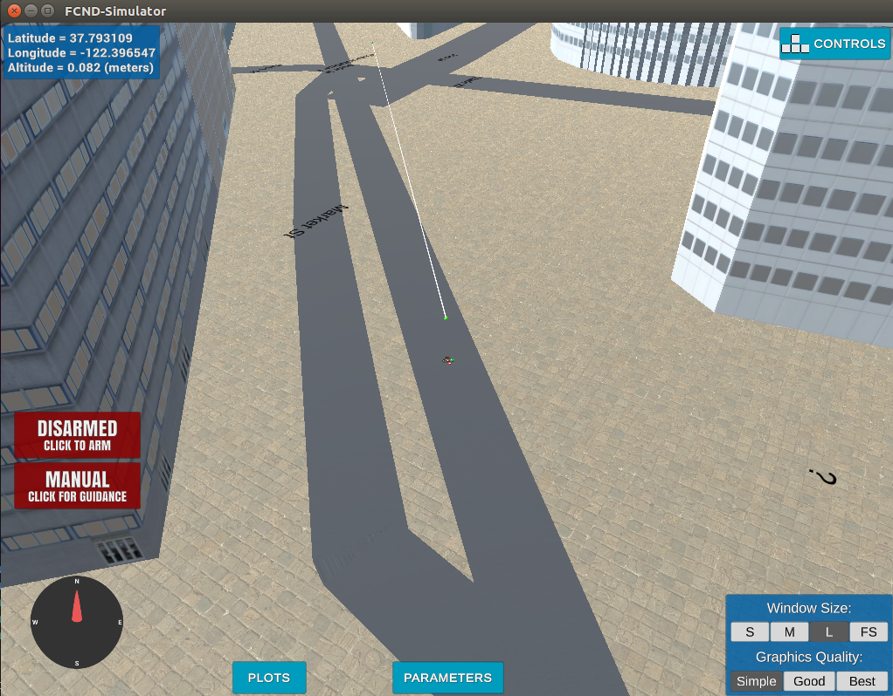

## Project: 3D Motion Planning


---


# Required Steps for a Passing Submission:
1. Load the 2.5D map in the colliders.csv file describing the environment.
2. Discretize the environment into a grid or graph representation.
3. Define the start and goal locations.
4. Perform a search using A* or other search algorithm.
5. Use a collinearity test or ray tracing method (like Bresenham) to remove unnecessary waypoints.
6. Return waypoints in local ECEF coordinates (format for `self.all_waypoints` is [N, E, altitude, heading], where the drone’s start location corresponds to [0, 0, 0, 0].
7. Write it up.
8. Congratulations!  Your Done!

## [Rubric](https://review.udacity.com/#!/rubrics/1534/view) Points
### Here I will consider the rubric points individually and describe how I addressed each point in my implementation.  

---
### Writeup / README

#### 1. Provide a Writeup / README that includes all the rubric points and how you addressed each one.  You can submit your writeup as markdown or pdf.  

You're reading it! Below I describe how I addressed each rubric point and where in my code each point is handled.

### Explain the Starter Code

#### 1. Explain the functionality of what's provided in `motion_planning.py` and `planning_utils.py`
The key point in this improvement is Planning State. In this new state, planing, a path planning algorithm works. To achieve that, plan_path() function is added.This function calculates a path between a start point where is obtained from a csv file and target point which can be passed as an argument.

`planning_utils.py` is also added to repository. This file is used for helper functions such as creating grid from csv file, A* search algorithm and pruning paths.

### Implementing Your Path Planning Algorithm

#### 1. Set your global home position
```
# DONE: Reading lat0, lon0 from colliders into floating point values
file = open("colliders.csv", "r")
line = file.readline()
file.close()
lat0 = float(line.replace('lat0 ', '').split(',')[0])
lon0 = float(line.replace(' lon0 ', '').split(',')[1])
print("Retrived home position Lat {0}, Lon {1}".format(lat0, lon0))

# DONE: Set home position to (lon0, lat0, 0)
self.set_home_position(lon0, lat0, 0)
```

First, CSV file provided is loaded. Then, first line of the file is read. Finally, lat0 and lon0 values are obtained via splitting of full line. `set_home_position` function is used to set home position with these values.

#### 2. Set your current local position
The global position information is obtained from `longitude`, `latitude` and `altitude` attributes. This information is converted to local position with `global_to_local` function.

```
# DONE: Retrieve current global position
global_pos = self.global_position
print('Global positon {0}'.format(global_pos))

# DONE: convert to current local position using global_to_local()
local_pos = global_to_local(global_pos, self.global_home)
print('Local positon {0}'.format(local_pos))
print('global home {0}, position {1}, local position {2}'.format(self.global_home, self.global_position, self.local_position))
```

#### 3. Set grid start position from local position
```
# Read in obstacle map
data = np.loadtxt('colliders.csv', delimiter=',', dtype='Float64', skiprows=2)

# Define a grid for a particular altitude and safety margin around obstacles
grid, north_offset, east_offset = create_grid(data, TARGET_ALTITUDE, SAFETY_DISTANCE)
print("North offset = {0}, east offset = {1}".format(north_offset, east_offset))

# Define starting point on the grid (this is just grid center)
grid_start = (-north_offset, -east_offset)

# DONE: convert start position to current position rather than map center
grid_start = (int(local_pos[0])-north_offset, int(local_pos[1])-east_offset)
```        
Grid start position is calculated with initial local position and offsets which is provided.
#### 4. Set grid goal position from geodetic coords
``` 
# DONE: adapt to set goal as latitude / longitude position and convert
target_local_pos = global_to_local(self.goal_pos_global, self.global_home)
grid_goal = (int(target_local_pos[0])-north_offset, int(target_local_pos[1])-east_offset)
```        
Target position can be passed as an argument when the script is started. Argument --lat_target is Latitude data, --lon_target is Longitude data, --alt_target is Altitude data. These arguments has also default initial values which are hard-coded.

``` 
parser.add_argument('--lat_target', type=float, default=37.793108, help="Target Latitude")
parser.add_argument('--lon_target', type=float, default=-122.396519, help="Target Longitude")
parser.add_argument('--alt_target', type=float, default=5.0, help="Target Altitude")
``` 

#### 5. Modify A* to include diagonal motion (or replace A* altogether)
A* search algorithm which is provided contains only 4 main directions. In order to add diagonal motion I added 4 new directions which are SW, NW, NE, SE to `Action` enum class.

``` 
SOUTH_WEST = (1, -1, 1.414)
NORTH_WEST = (-1, -1, 1.414)
NORTH_EAST = (-1, 1, 1.414)
SOUTH_EAST = (1, 1, 1.414)
``` 

In addition, 4 new value-check codes are aded to `valid_actions function`.

``` 
if (x + 1 > n or y - 1 < 0) or grid[x + 1, y - 1] == 1:
    valid_actions.remove(Action.SOUTH_WEST) 
if (x - 1 < 0 or y - 1 < 0) or grid[x - 1, y - 1] == 1:
    valid_actions.remove(Action.NORTH_WEST)
if (x - 1 < 0 or y + 1 > m) or grid[x - 1, y + 1] == 1:
    valid_actions.remove(Action.NORTH_EAST)
if (x + 1 > n or y + 1 > m) or grid[x + 1, y + 1] == 1:
    valid_actions.remove(Action.SOUTH_EAST)
``` 
First screen shot is planned path without diagonal movement, the second is result of improvements.




#### 6. Cull waypoints 

Two methods, Collinearity and Bresenham, are implemented to clear undesired way points. Two methods are placed into `planning_utils.py`

`Collinearity` 
``` 
def collinearity_check(p1, p2, p3):   
    m = np.concatenate((p1, p2, p3), 0)
    det = np.linalg.det(m)
    return abs(det) < 0.01

def prune_path(path):
    pruned_path = [p for p in path]
    
    i = 0
    while i < len(pruned_path) - 2:
        p1 = point(pruned_path[i])
        p2 = point(pruned_path[i+1])
        p3 = point(pruned_path[i+2])   
        if collinearity_check(p1, p2, p3):
            pruned_path.remove(pruned_path[i+1])
        else:
            i += 1
    return pruned_path
``` 


`Bresenham` 
``` 
def bresenham_check(p1, p2, grid):
    cells = list(bresenham(p1[0], p1[1], p2[0], p2[1]))
    for q in cells:
        if grid[q[0], q[1]] == 1:
            return False
    return True

def bresenham_prune_path(path, grid):
    pruned_path = [p for p in path]
    i = 0
    while i < len(pruned_path) - 2:    
        if bresenham_check(pruned_path[i], pruned_path[i+2], grid):
            pruned_path.remove(pruned_path[i+1])
        else:
            i += 1
    return pruned_path 
``` 



### Execute the flight
#### 1. Does it work?
It works!

### Double check that you've met specifications for each of the [rubric](https://review.udacity.com/#!/rubrics/1534/view) points.
  
# Extra Challenges: Real World Planning

For an extra challenge, consider implementing some of the techniques described in the "Real World Planning" lesson. You could try implementing a vehicle model to take dynamic constraints into account, or implement a replanning method to invoke if you get off course or encounter unexpected obstacles.


